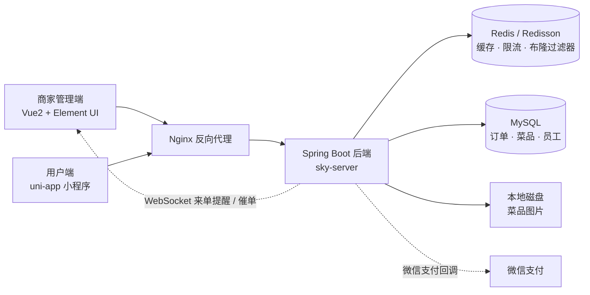

# 智能化生活服务平台（外卖点餐系统）

面向中小商家的点餐与配送服务平台：**商家管理端（Vue2 + Element UI）+ 用户端（uni-app 小程序）共用同一套 Spring Boot 后端**。管理端负责员工权限、菜品/套餐管理、订单处理与营业数据统计导出；用户端支持微信登录、菜单套餐浏览、购物车、地址簿、下单支付、订单跟踪与催单。

> 个人学习/课程实践项目，用于完整跑通"点餐—下单—支付—来单提醒—超时闭环"这条业务链，以及缓存防护、接口限流、公共字段填充等工程化能力，**非生产系统**。

---

## 技术栈

| 分类 | 技术 |
|---|---|
| 后端 | Spring Boot 2、Spring MVC、MyBatis、PageHelper、Druid 连接池 |
| 存储 | MySQL、Redis（Spring Data Redis + Redisson）、本地磁盘图片存储 |
| 通信 | WebSocket（来单提醒 / 催单）、微信支付（下单链路） |
| 鉴权 | JWT 无状态令牌 + 管理端/用户端双拦截器 + ThreadLocal 上下文 |
| 前端 | 管理端 Vue2 + Element UI + TypeScript；用户端 uni-app |
| 运维 | Nginx 反向代理、Linux 部署、Docker 基础镜像与 SQL 脚本 |
| 接口文档 | Knife4j（Swagger 增强） |

---

## 技术亮点

### 1. 多级缓存与防护（防穿透 / 防雪崩 / 一致性）

- **旁路缓存 + 前缀清理**：菜品按分类缓存（key `dish_{categoryId}`），未命中回源数据库并回填；菜品/套餐变更时按 `dish_*` 前缀清理缓存，保证读到的不是旧菜单。
- **空值缓存防穿透**：查询结果为空时写入 5 分钟空值缓存（`DISH_CACHE_NULL_TTL = 300`），把穿透请求挡在数据库之前。
- **随机 TTL 防雪崩**：每个缓存实例的过期时间 = 基础 TTL + 随机抖动（菜品 `1800s + [0,300]s`；套餐由自定义 `RandomTtlRedisCacheManager` 生成 `1800s + [0,600]s` 的独立过期时间），避免同一时刻集中失效。
- **Redisson 布隆过滤器兜底**：`DishBloomFilter` 使用 `RBloomFilter`（`bloom:filter:dish`，预估 10000 个元素、误判率 1%），启动时预热数据库全部菜品 ID，并设置 7 天过期；`mightContain` 返回 false 时直接判定"菜品不存在"，请求不再走缓存与数据库。Redis 异常时自动降级（`available=false` 全部放行），保证点餐主流程不受影响。
- 已知取舍：布隆过滤器不支持删除元素（菜品删除后仍返回"可能存在"，靠数据库兜底）；`keys("dish_*")` 是 O(N) 全量匹配，生产应改为 `SCAN` 渐进清理。

### 2. 接口限流与统一鉴权

- **Redis ZSet + Lua 滑动窗口限流**：`@RateLimit(key, window, maxCount)` 注解 + `RateLimitAspect` 切面，key 粒度 `rate:limit:{接口}:{ip}`；ZSet 以请求时间戳为 score、`时间戳 + UUID` 为 member，Lua 脚本内一次性完成"剔除窗口外记录 → 统计窗口内请求数 → 未超限则写入并续期"，保证原子性，避免"先查后写"导致的并发超发。
- **切面优先级**：`@Order(1)` 让限流先于 `@Cacheable` 等切面执行，即使请求命中缓存也同样计入限流统计。
- **为什么用 StringRedisTemplate**：Lua 里需要 `tonumber(ARGV[1])`，而项目默认的 `RedisTemplate` 使用 JDK 序列化会导致解析失败。
- **真实客户端 IP**：优先从 `X-Forwarded-For`（取第一段）→ `X-Real-IP` → `getRemoteAddr()` 获取，适配 Nginx 反向代理场景。
- **统一鉴权**：JWT 无状态令牌 + 管理端/用户端两个拦截器，校验通过后把身份 ID 写入 `BaseContext`（ThreadLocal）供业务层复用。

### 3. 订单通知与超时闭环

- **WebSocket 长连接**：`WebSocketServer` 以 `/ws/{sid}` 建立连接并维护会话表；支付成功后向商家端推送 `type=1` 来单提醒（页面响铃 + 跳转订单页），用户催单时推送 `type=2`，商家无需轮询。
- **超时自动取消**：`OrderTask` 每分钟扫描"待支付且下单超过 15 分钟"的订单自动取消并记录取消原因与时间，形成超时闭环。
- **滞留订单批量处理**：每天凌晨 1 点批量处理仍处于派送中的订单，避免长期挂单。
- 已知缺口：`OrderMapper.update` 只按 id 更新、未带状态条件，理论上存在"定时任务取消"与"用户支付成功"并发覆盖的竞态，可改为条件更新（`where status = 待支付`）+ 受影响行数判断。

### 4. 公共字段自动填充与统一异常处理

- **`@AutoFill` + AOP + 反射**：在 Mapper 层拦截 insert/update，统一填充创建/更新时间与操作人（从 `BaseContext` 取当前用户），消除各业务里重复的赋值代码。
- **全局异常处理**：`@RestControllerAdvice` 统一捕获并返回错误提示，配合自定义业务异常体系（如 `RateLimitException`）实现"限流被拒也给用户友好文案"。
- 已知缺口：`BaseContext.removeCurrentId()` 只定义未在 `afterCompletion` 中调用，线程池复用场景下存在上下文串号风险。

---

## 系统架构



## 模块结构

```
sky-take-out
├── sky-common          公共模块：常量、异常、工具类、上下文（BaseContext）
├── sky-pojo            实体 / DTO / VO
├── sky-server          后端服务
│   ├── annotation      @AutoFill、@RateLimit 自定义注解
│   ├── aspect          AutoFIllAspect（公共字段填充）、RateLimitAspect（滑动窗口限流）
│   ├── component       DishBloomFilter（Redisson 布隆过滤器）
│   ├── config          Redis 缓存/随机 TTL、Redisson、WebMvc、WebSocket 配置
│   ├── controller      admin（管理端）/ user（用户端）/ notify（支付回调）
│   ├── handler         GlobalExceptionHandler 全局异常处理
│   ├── interceptor     JWT 管理端 / 用户端拦截器
│   ├── task            OrderTask 订单超时与滞留处理
│   └── websocket       WebSocketServer 来单提醒 / 催单推送
├── web-sky-admin       管理端前端（Vue2 + Element UI）
└── web-sky-weixin-uniapp 用户端前端（uni-app）
```

## 菜品数据示例

系统上传的菜品图片存储于本地磁盘（`sky-server/base-image/`，已加入 `.gitignore` 不入库），下面是几张缩略图：

| 点心套餐 | 柠檬茶 | 珍珠奶茶 | 玉米 |
|---|---|---|---|
|  |  |  |  |

## 快速开始

**环境要求**：JDK 8+、Maven 3.6+、MySQL 5.7+、Redis 5+、Node.js（前端）

1. **初始化数据库**：导入 `sky-server/base-sql/sky_take_out.sql`
2. **修改配置**：`sky-server/src/main/resources/application-dev.yml`（数据源、Redis、微信支付商户信息）
3. **启动后端**：
   ```bash
   mvn clean package -DskipTests
   java -jar sky-server/target/sky-server-1.0-SNAPSHOT.jar
   ```
4. **启动管理端**：
   ```bash
   cd web-sky-admin && npm install && npm run serve
   ```
5. **接口文档**：启动后访问 `http://localhost:8080/doc.html`（Knife4j）

## 部署

Linux + Nginx 的完整部署步骤见 [DEPLOYMENT_LINUX.md](DEPLOYMENT_LINUX.md)（含 Nginx 的 `/`、`/api/`、`/user/`、`/ws/` 四段 location 配置与 jar 启动脚本）。

## 说明

- 上传图片目录 `sky-server/base-image/`、构建产物 `target/`、前端依赖与构建产物均已加入 `.gitignore`。
- 本项目为学习实践项目，用于面试展示工程能力，非线上生产系统。
